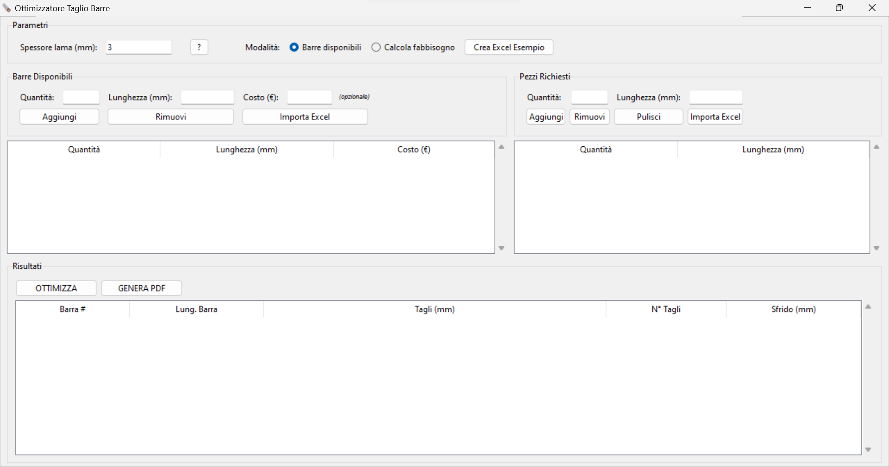

# Ottimizzatore Taglio Barre

Un'applicazione desktop con interfaccia grafica per ottimizzare il taglio di barre e profilati, minimizzando gli scarti e riducendo i costi di produzione.

## 📥 Download

**[⬇️ Scarica l'eseguibile per Windows (v1.0.0)](https://github.com/Nicolacecca/ottimizzatore-taglio-barre/releases/latest)**

Nessuna installazione richiesta! Scarica il file `.exe` ed eseguilo direttamente.

---

## Caratteristiche

- **Interfaccia grafica intuitiva** - Facile da usare, non richiede competenze tecniche
- **Ottimizzazione intelligente** - Algoritmo First Fit Decreasing per minimizzare gli scarti
- **Supporto multi-barra** - Gestione di barre di diverse lunghezze
- **Scenari multipli** - Genera e confronta diverse soluzioni di taglio
- **Export PDF professionale** - Report completo con schema di taglio
- **Import Excel** - Importa dati da file Excel formattati
- **Calcolo fabbisogno** - Determina il materiale da ordinare al venditore

## Screenshot



---

## 🚀 Installazione

### Metodo 1: Download eseguibile (CONSIGLIATO per utenti Windows)

1. [Scarica l'ultima release](https://github.com/Nicolacecca/ottimizzatore-taglio-barre/releases/latest)
2. Estrai o esegui il file `OttimizzatoreTaglioBarre.exe`
3. L'applicazione è pronta all'uso!

**Nota**: Windows Defender potrebbe mostrare un avviso. Clicca su "Maggiori informazioni" → "Esegui comunque". È normale per software senza firma digitale.

### Metodo 2: Esecuzione da codice sorgente (richiede Python)

1. Clona il repository:
```bash
git clone https://github.com/Nicolacecca/ottimizzatore-taglio-barre.git
cd ottimizzatore-taglio-barre
```

2. Installa le dipendenze:
```bash
pip install -r requirements.txt
```

3. Esegui l'applicazione:
```bash
python ottimizzatore_taglio.py
```

### Metodo 3: Creazione eseguibile personalizzato

Se vuoi creare il tuo eseguibile:

```bash
pip install pyinstaller
python build_exe.py
```

L'eseguibile sarà disponibile nella cartella `dist/`.

---

## 📖 Utilizzo

### 1. Configurazione iniziale

- **Barre disponibili**: Inserisci le lunghezze e quantità delle barre in magazzino
- **Spessore lama**: Imposta lo spessore della lama di taglio (default: 3mm)

### 2. Inserimento pezzi richiesti

- **Manualmente**: Aggiungi i pezzi specificando lunghezza e quantità
- **Da Excel**: Importa i dati da file Excel formattati (usa "Crea Excel Esempio" per il formato corretto)

### 3. Ottimizzazione

- Clicca su **"Ottimizza"** per calcolare la soluzione migliore
- Genera più scenari per confrontare diverse opzioni
- Visualizza scarti e numero di barre utilizzate

### 4. Esportazione

- **PDF**: Report completo con schema di taglio per ogni barra, pronto per l'officina

### 5. Import/Export Excel

L'applicazione può:
- **Creare file Excel di esempio** con il pulsante "Crea Excel Esempio"
- **Importare dati** da file Excel formattati come gli esempi generati
- I file esempio includono:
  - Barre disponibili in magazzino
  - Catalogo venditore con prezzi
  - Lista pezzi richiesti

## 🔧 Funzionalità avanzate

### Calcola fabbisogno materiale

Funzione intelligente che calcola automaticamente il materiale da ordinare al venditore:
- Analizza le barre disponibili nel magazzino
- Calcola il fabbisogno minimo considerando l'ottimizzazione
- Riduce gli scarti e i costi di acquisto
- Suggerisce cosa ordinare in base al catalogo del venditore

### Gestione scenari

- Salva fino a 10 scenari diversi
- Confronta le soluzioni
- Scegli la migliore per la tua produzione

## Esempio pratico

Hai in magazzino:
- 10 barre da 6000mm
- 5 barre da 4000mm

Devi tagliare:
- 15 pezzi da 1200mm
- 20 pezzi da 800mm
- 10 pezzi da 500mm

L'applicazione ti dira:
1. Quante barre ti servono
2. Come tagliare ogni barra
3. Quanto scarto avrai
4. Il report in PDF da portare in officina

## Tecnologie utilizzate

- **Python 3** - Linguaggio di programmazione
- **Tkinter** - Interfaccia grafica
- **ReportLab** - Generazione PDF
- **OpenPyXL** - Gestione file Excel
- **PyInstaller** - Creazione eseguibili

## Algoritmo di ottimizzazione

L'applicazione utilizza l'algoritmo **First Fit Decreasing (FFD)**:

1. Ordina i pezzi per lunghezza decrescente
2. Per ogni pezzo, cerca la prima barra con spazio sufficiente
3. Se non trova spazio, usa una nuova barra
4. Minimizza lo scarto totale

L'algoritmo include variazioni casuali controllate per generare scenari diversi ad ogni esecuzione.

## Contribuire

Le contribuzioni sono benvenute! Per contribuire:

1. Fai un fork del progetto
2. Crea un branch per la tua feature (`git checkout -b feature/NuovaFunzionalita`)
3. Committa le modifiche (`git commit -m 'Aggiunta NuovaFunzionalita'`)
4. Push al branch (`git push origin feature/NuovaFunzionalita`)
5. Apri una Pull Request

## Segnalazione bug

Se trovi un bug, apri una [Issue](https://github.com/Nicolacecca/ottimizzatore-taglio-barre/issues) descrivendo:
- Il problema riscontrato
- I passi per riprodurlo
- Il comportamento atteso
- Screenshot (se applicabili)

## Roadmap

- [ ] Supporto per formati di esportazione aggiuntivi (CSV, JSON)
- [ ] Visualizzazione grafica 3D dei tagli
- [ ] Database storico dei lavori
- [ ] Calcolo automatico dei costi
- [ ] Supporto multi-lingua
- [ ] API REST per integrazione con altri software

## Licenza

Questo progetto e distribuito sotto licenza MIT. Vedi il file [LICENSE](LICENSE) per maggiori dettagli.

## Autore

Creato con passione per ottimizzare il lavoro in officina.

## Supporto

Se trovi utile questo progetto, considera di:
- Mettere una stella su GitHub
- Condividerlo con colleghi
- Segnalare miglioramenti

---

**Nota**: Questo software e fornito "cosi com'e", senza garanzie di alcun tipo. Verifica sempre i calcoli prima dell'uso in produzione.
